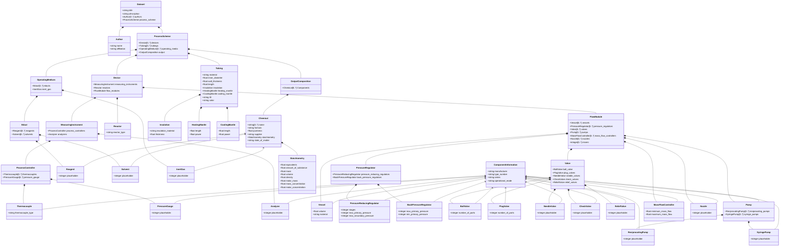

```mermaid
classDiagram
    ComponentInformation <-- Thermocouple
    ComponentInformation <-- PressureGauge
    ComponentInformation <-- Analyzer
    Chemical <-- Reagent
    Chemical <-- Solvent
    Chemical <-- InertGas
    ComponentInformation <-- Vessel
    ComponentInformation <-- PressureReducingRegulator
    ComponentInformation <-- BackPressureRegulator
    ComponentInformation <-- BallValve
    ComponentInformation <-- PlugValve
    ComponentInformation <-- NeedleValve
    ComponentInformation <-- CheckValve
    ComponentInformation <-- ReliefValve
    ComponentInformation <-- Pump
    ComponentInformation <-- ReciprocatingPump
    ComponentInformation <-- SyringePump
    ComponentInformation <-- MassFlowController
    ComponentInformation <-- Nozzle
    Dataset *-- Author
    Dataset *-- ProcessScheme
    ProcessScheme *-- Device
    ProcessScheme *-- Tubing
    ProcessScheme *-- OperatingMedium
    ProcessScheme *-- OutputComposition
    Device *-- MeasuringInstrument
    Device *-- Reactor
    Device *-- FlowModule
    MeasuringInstrument *-- ProcessController
    MeasuringInstrument *-- Analyzer
    ProcessController *-- Thermocouple
    ProcessController *-- PressureGauge
    Tubing *-- Insulation
    Tubing *-- HeatingMantle
    Tubing *-- CoolingMantle
    Chemical *-- Stoichiometry
    OperatingMedium *-- Educt
    OperatingMedium *-- InertGas
    Educt *-- Reagent
    Educt *-- Solvent
    OutputComposition *-- Chemical
    FlowModule *-- Vessel
    FlowModule *-- PressureRegulator
    FlowModule *-- Valve
    FlowModule *-- Pump
    FlowModule *-- MassFlowController
    FlowModule *-- Nozzle
    PressureRegulator *-- PressureReducingRegulator
    PressureRegulator *-- BackPressureRegulator
    Valve *-- BallValve
    Valve *-- PlugValve
    Valve *-- NeedleValve
    Valve *-- CheckValve
    Valve *-- ReliefValve
    Pump *-- ReciprocatingPump
    Pump *-- SyringePump
    
    class Dataset {
        +string title*
        +string description*
        +Author[0..*] authors*
        +ProcessScheme process_scheme
    }
    
    class Author {
        +string name*
        +string affiliation
    }
    
    class ProcessScheme {
        +Device[0..*] devices
        +Tubing[0..*] tubings
        +OperatingMedium[0..*] operating_media
        +OutputComposition output
    }
    
    class ComponentInformation {
        +string manufacturer
        +string type_number
        +string series
        +string operational_mode
    }
    
    class Device {
        +MeasuringInstrument measuring_instruments
        +Reactor reactors
        +FlowModule flow_modules
    }
    
    class MeasuringInstrument {
        +ProcessController process_controllers
        +Analyzer analyzers
    }
    
    class ProcessController {
        +Thermocouple[0..*] thermocouples
        +PressureGauge[0..*] pressure_gauge
    }
    
    class Thermocouple {
        +string thermocouple_type
    }
    
    class PressureGauge {
        +integer placeholder
    }
    
    class Analyzer {
        +integer placeholder
    }
    
    class Reactor {
        +string reactor_type
    }
    
    class Tubing {
        +string material
        +float inner_diameter
        +float wall_thickness
        +float length
        +Insulation insulation
        +HeatingMantle heating_mantle
        +CoolingMantle cooling_mantle
        +string ID
        +string color
    }
    
    class Insulation {
        +string insulation_material
        +float thickness
    }
    
    class HeatingMantle {
        +float length
        +float power
    }
    
    class CoolingMantle {
        +float length
        +float power
    }
    
    class Chemical {
        +string[0..*] name
        +string formula
        +float pureness
        +string supplier
        +Stoichiometry stoichiometry
        +string state_of_matter
    }
    
    class Stoichiometry {
        +float equivalents
        +float amount_of_substance
        +float mass
        +float volume
        +float density
        +float molar_mass
        +float mass_concentration
        +float molar_concentration
    }
    
    class OperatingMedium {
        +Educt[0..*] educts
        +InertGas inert_gas
    }
    
    class Educt {
        +Reagent[0..*] reagents
        +Solvent[0..*] solvents
    }
    
    class Reagent {
        +integer placeholder
    }
    
    class Solvent {
        +integer placeholder
    }
    
    class InertGas {
        +integer placeholder
    }
    
    class OutputComposition {
        +Chemical[0..*] Components
    }
    
    class FlowModule {
        +Vessel[0..*] vessels
        +PressureRegulator[0..*] pressure_regulators
        +Valve[0..*] valves
        +Pump[0..*] pumps
        +MassFlowController[0..*] mass_flow_controllers
        +Nozzle[0..*] nozzles
        +integer[0..*] mixers
    }
    
    class Vessel {
        +float volume
        +string material
    }
    
    class PressureRegulator {
        +PressureReducingRegulator pressure_reducing_regulators
        +BackPressureRegulator back_pressure_regulators
    }
    
    class PressureReducingRegulator {
        +integer stages
        +integer max_primary_pressure
        +integer max_secundary_pressure
    }
    
    class BackPressureRegulator {
        +integer max_primary_pressure
        +integer min_primary_pressure
    }
    
    class Valve {
        +BallValve ball_valve
        +PlugValve plug_valves
        +NeedleValve needle_valves
        +CheckValve check_valves
        +ReliefValve relief_valves
    }
    
    class BallValve {
        +integer number_of_ports
    }
    
    class PlugValve {
        +integer number_of_ports
    }
    
    class NeedleValve {
        +integer placeholder
    }
    
    class CheckValve {
        +integer placeholder
    }
    
    class ReliefValve {
        +integer placeholder
    }
    
    class Pump {
        +ReciprocatingPump[0..*] reciprocating_pumps
        +SyringePump[0..*] syringe_pumps
    }
    
    class ReciprocatingPump {
        +integer placeholder
    }
    
    class SyringePump {
        +integer placeholder
    }
    
    class MassFlowController {
        +float minimum_mass_flow
        +float maximum_mass_flow
    }
    
    class Nozzle {
        +integer placeholder
    }
    
```