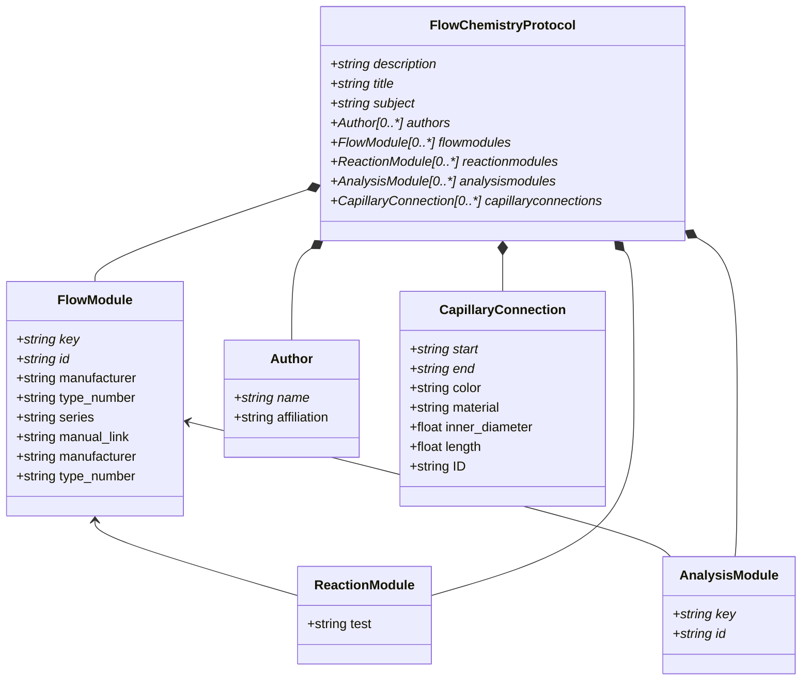

```mermaid
classDiagram
    FlowModule <-- ReactionModule
    FlowModule <-- AnalysisModule
    FlowChemistryProtocol *-- Author
    FlowChemistryProtocol *-- FlowModule
    FlowChemistryProtocol *-- ReactionModule
    FlowChemistryProtocol *-- AnalysisModule
    FlowChemistryProtocol *-- CapillaryConnection
    
    class FlowChemistryProtocol {
        +string description*
        +string title*
        +string subject*
        +Author[0..*] authors*
        +FlowModule[0..*] flowmodules*
        +ReactionModule[0..*] reactionmodules*
        +AnalysisModule[0..*] analysismodules*
        +CapillaryConnection[0..*] capillaryconnections*
    }
    
    class Author {
        +string name*
        +string affiliation
    }
    
    class CapillaryConnection {
        +string start*
        +string end*
        +string color
        +string material
        +float inner_diameter
        +float length
        +string ID
    }
    
    class FlowModule {
        +string key*
        +string id*
        +string manufacturer
        +string type_number
        +string series
        +string manual_link
        +string manufacturer
        +string type_number
    }
    
    class ReactionModule {
        +string test
    }
    
    class AnalysisModule {
        +string key*
        +string id*
    }
    
```